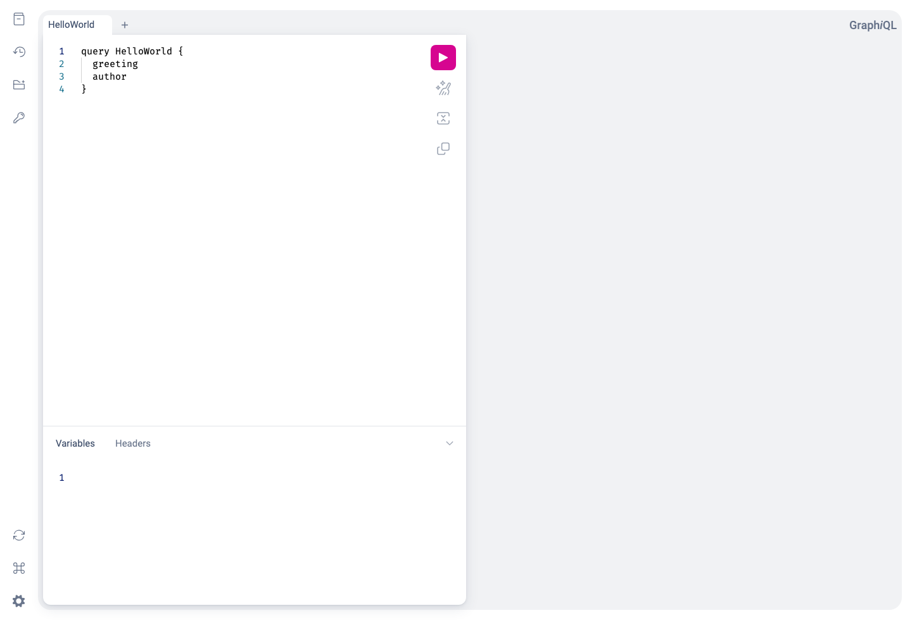
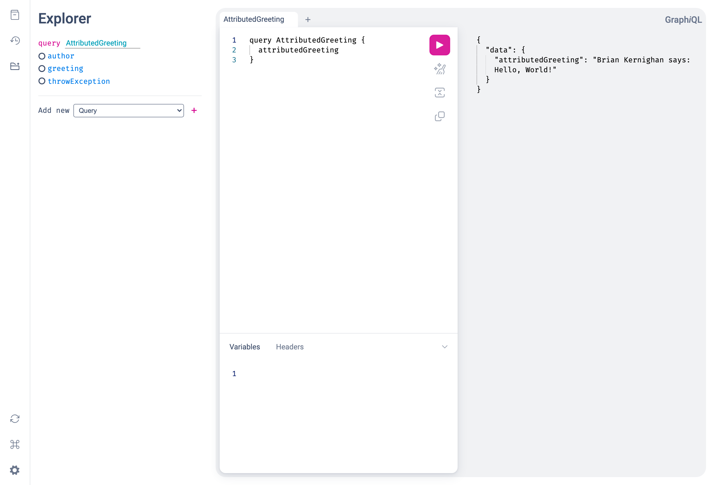

Viaduct is built for teams that want GraphQL to feel easy on day one and solid on day one hundred. This quickstart gets you from `git clone` to a running GraphQL service fast, then shows you the two parts that matter most: writing a resolver and understanding how the service is wired.

## Launch Viaduct

The fastest way to try Viaduct is the standalone [`ktor-starter`](https://github.com/viaduct-dev/ktor-starter). It gives you a small Ktor service with Viaduct already embedded, a GraphQL endpoint, and a built-in GraphiQL UI.

Before you start, make sure you have:

- Java JDK 21 or newer
- Git

Then clone the starter:

```shell
git clone https://github.com/viaduct-dev/ktor-starter.git
```

Start the service:

```shell
cd ktor-starter
```

```shell
./gradlew run
```

Open GraphiQL in your browser:

```shell
open http://localhost:8080/graphiql
```

You will land in a GraphiQL workspace with a starter query ready to run:



Press the play button and you'll see the result:

```json
{
  "data": {
    "greeting": "Hello, World!",
    "author": "Brian Kernighan"
  }
}
```

At this point you have a complete Viaduct service running locally: Ktor is serving HTTP, Viaduct is planning and executing GraphQL operations, and tenant resolvers are producing the response.

## Understanding the Application

Now that we have a working service, let's look at how it is structured. The `ktor-starter` has been kept small on purpose, so you can quickly understand where the schema lives, where the resolvers live, and where to make your first change.

### Project structure

The starter is split into a small web server and a tenant module:

```text
ktor-starter/
├── build.gradle.kts
├── settings.gradle.kts
├── src/main/kotlin/com/example/viadapp/  -- web server
│   ├── Routing.kt
│   └── ViaductService.kt
└── resolvers/                            -- tenant module
    ├── build.gradle.kts
    └── src/main/
        ├── viaduct/schema/schema.graphqls
        └── kotlin/com/example/viadapp/resolvers/
            └── HelloWorldResolvers.kt
```

The root project hosts the web server. The `resolvers` project contains our tenant module, which contains the actual application code: the GraphQL schema and the Kotlin code that implements it.  We'll look more deeply at the tenant module in this section, and at the web server in the next.

### The schema

The schema lives in `resolvers/src/main/viaduct/schema/schema.graphqls`:

```graphql
extend type Query {
  greeting: String @resolver
  author: String @resolver
}
```

The `@resolver` directive tells Viaduct that each of these fields is implemented by application code. In practice, that means Viaduct generates base classes from the schema and expects you to provide Kotlin resolvers that fill in the values.

### The resolvers

The starter resolvers live in `resolvers/src/main/kotlin/com/example/viadapp/resolvers/`:

```kotlin
@Resolver
class GreetingResolver : QueryResolvers.Greeting() {
    override suspend fun resolve(ctx: Context) = "Hello, World!"
}

@Resolver
class AuthorResolver : QueryResolvers.Author() {
    override suspend fun resolve(ctx: Context) = "Brian Kernighan"
}
```

There are two important things happening here:

- Each resolver extends a generated base class such as `QueryResolvers.Greeting()`.
- Each resolver is annotated with `@Resolver` and overrides `resolve()` to produce the field value.

This is the core Viaduct developer loop: define fields in the schema, implement them in Kotlin, then browse the result through GraphQL.

### Writing a Resolver

Let's add a new field so you can experience that workflow end to end.

First, extend the schema in `resolvers/src/main/viaduct/schema/schema.graphqls`:

```graphql
extend type Query {
  attributedGreeting: String @resolver
}
```

Next, add a new resolver to `resolvers/src/main/kotlin/com/example/viadapp/resolvers/HelloWorldResolvers.kt`:

```kotlin
@Resolver("""
  greeting
  author
""")
class AttributedGreetingResolver : QueryResolvers.AttributedGreeting() {
    override suspend fun resolve(ctx: Context): String {
        val greeting = ctx.getObjectValue().getGreeting()
        val author = ctx.getObjectValue().getAuthor()
        return "$author says: $greeting"
    }
}
```

The parameter provided to the `@Resolver` annotation is a central Viaduct feature. It declares that this resolver depends on the existing `greeting` and `author` fields. Given this annotation, Viaduct will make those values available through `ctx.getObjectValue()` before your resolver runs.

After changing the schema, stop the running server and then rebuild and run:

```shell
./gradlew run
```

Back in GraphiQL, run:

```graphql
query AttributedGreeting {
  attributedGreeting
}
```

You will see the new field come to life immediately:



That small developer loop captures the core Viaduct experience: describe the field in schema, implement the resolver in Kotlin, and browse the result in a live GraphQL service.

## Understanding the Service

If you are evaluating Viaduct for real adoption, the next question is usually not just "can I write a resolver?" but "how hard is this to fit into my stack?" Let's use `ktor-starter` to explore this question.

### The Ktor host

The `ktor-starter` project illustrates how Viaduct might fit into a Ktor-based serving stack.  While toher Viaduct demo apps illustrate Viaduct integrating into other serving stacks, the pattern across all stacks is similar to what we see here with Ktor.

`src/main/kotlin/com/example/viadapp/ViaductService.kt` is the Ktor entry point: it contains the server's `main` function and configures `io.ktor.server.application.Application`.

`Routing.kt` contains the GraphQL and GraphiQL routes:

```kotlin
// Create and initialize the [Viaduct] instance used to execute GraphQL operations
private val viaduct by lazy {
    BasicViaductFactory.create(
        scopedSchemas = listOf(SchemaScopeInfo(SCHEMA_ID)),
    )
}

fun Application.configureRouting() {
    routing {
        route("/graphql") {
            post { // Extract GraphQL operation from HTTP request and pass to Viaduct for execution
                val request = call.receive<Map<String, Any?>>() as Map<String, Any>

                val query = request["query"] as? String
                if (query == null) {
                    call.respond(
                        HttpStatusCode.BadRequest,
                        mapOf("errors" to listOf(mapOf("message" to "Query parameter is required and must be a string")))
                    )
                    return@post
                }

                val executionInput = ExecutionInput.create(
                    operationText = query,
                    variables = (request["variables"] as? Map<String, Any>) ?: emptyMap(),
                )

                val result = viaduct.executeAsync(executionInput).await()
                call.respond(result.toSpecification())
            }
        }

        get("/graphiql") {
            call.respondText(graphiQLHtml(ktorStarterGraphiQLConfig), ContentType.Text.Html)
        }

        ...other GraphiQL-related routes
    }
}
```

This is the main service-engineering seam in the starter. The Ktor app is ordinary application code; the Viaduct instance is a dependency you create and hand requests to.

### The Gradle wiring

The root `build.gradle.kts` applies the `viaduct.application` plugin and hosts the Ktor app. The `resolvers/build.gradle.kts` file applies `viaduct.module`, which tells Viaduct that this module contributes schema and resolver code.

Here is the root application build:

```kotlin
plugins {
    alias(libs.plugins.kotlinJvm)
    alias(libs.plugins.ktor)
    alias(libs.plugins.viaduct.application) // Marks this project as the "root" of a Viaduct application
}

application {
    mainClass.set("com.example.viadapp.ViaductServiceKt")
}

viaductApplication {
    modulePackagePrefix.set("com.example.viadapp")
}

dependencies {
    // Viaduct framework
    implementation(libs.viaduct.api)
    implementation(libs.viaduct.runtime)

    // Application logic from our tenant module
    implementation(project(":resolvers"))

    implementation(libs.ktor.server.core.jvm)
    ...other ktor dependencies
}
```

And here is the tenant module build:

```kotlin
plugins {
    `java-library`
    alias(libs.plugins.kotlinJvm)
    alias(libs.plugins.ksp)
    alias(libs.plugins.viaduct.module) // Marks this project as a tenant module
}

viaductModule {
    modulePackageSuffix.set("resolvers")
}

dependencies {
    api(libs.viaduct.api)
    implementation(libs.viaduct.runtime)
}
```

This particular example has just one tenant module, but your Viaduct application can have multiple tenant modules, allowing different teams to own different parts of the overall Viaduct schema.  The host service, in the meantime, handles the concerns that usually matter to platform-minded teams: web framework integration, runtime configuration, dependency injection, observability, and deployment.

## What's Next

- Want to go deeper on resolver patterns, generated code, and schema features? Head to [Developers](../docs/developers/index.md).
- Want to understand runtime configuration, multi-tenancy, and operating Viaduct in a real service? Head to [Service Engineers](../docs/service_engineers/index.md).
- Want to keep experimenting? Replace the demo fields with a real backend call and keep using GraphiQL as your feedback loop.
